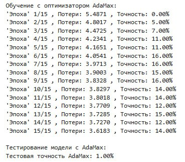
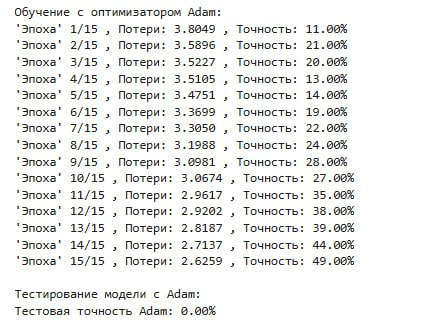
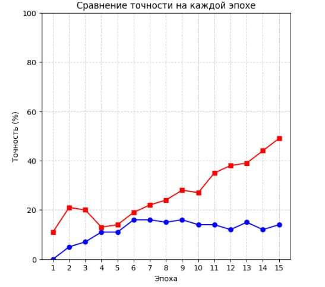

# LAB1
# ЛАБОРАТОРНАЯ РАБОТА №1
## Отчет по лабораторной работе
### 1. Теоретическая база
Цель работы: научиться реализовывать один из алгоритмов глубокого обучения с нуля - решать задачу классификации марок автомобилей. В данной работе использована модель ResNet50, которая представляет собой простую нейронную сеть с двумя полносвязными слоями.

**ResNet-50** — это сверточная нейронная сеть (CNN), состоящая из 50 слоев.

Она была предложена в работе "Deep Residual Learning for Image Recognition" и является одной из самых популярных архитектур для задач классификации изображений. ResNet-50 использует "остаточные блоки" (_residual blocks_), которые позволяют эффективно обучать глубокие сети, избегая проблемы исчезающего градиента.

Модель обучается с двумя разными оптимизаторами: ***AdaMax*** и ***Adam***.

После обучения производится оценка точности модели на тестовом наборе данных.

Краткое описание оптимизаторов:

**1. AdaMax**

Это вариант оптимизатора Adam, который использует бесконечную норму для обновления параметров. Он может быть более устойчивым к выбору гиперпараметров.

**2. Adam**

Один из самых популярных оптимизаторов, который сочетает в себе преимущества методов Momentum и RMSProp. Он адаптивно настраивает learning rate для каждого параметра.

### 2. Описание разработанной системы

Принцип работы системы:
- Используются два набора данных: _обучающий_ и _тестовый_, содержащие изображения автомобилей и метки классов.
- Предобработка данных: изображения преобразуются к размеру **224x224** пикселей (стандартный размер для ResNet).
- Обучение: модель обучается **с нуля** (без использования предобученных весов) с использованием двух оптимизаторов: AdaMax и Adam.
- Тестирование: после обучения модель оценивается на тестовом наборе данных, вычисляются **потери** и **точность** на тестовых данных.

Архитектура:
- Входные данные: классы и аннотации к изображениям.
- Модель: ResNet50 (без использования предбученных весов). 
- Функция потерь: ***CrossEntropyLoss***.
- Оптимизаторы: ***Adam***, ***AdaMax***.
- Инфраструктура: ***PyTorch***, ***matplotlib***, ***numpy***.

Алгоритм работы:
1. Загрузка данных (датасет с изображениями автомобилей, аннотациями и метаданными).

- Аннотации содержат имена файлов изображений и метки классов, метаданные содержат имена классов.

2. Предобработка данных

- Изображения преобразуются к размеру 224x224 пикселей.

- Применяется нормализация с использованием средних значений и стандартных отклонений ImageNet.

- Создаются датасеты и загрузчики данных.

3. Обучение модели

- Используется модель ResNet-50 с измененным последним полносвязным слоем. Модель обучается на обучающем наборе данных, минимизируя функцию потерь и обновляя веса.

4. Оценка модели

- После обучения модель тестируется на тестовом наборе данных. Вычисляется точность на тестовом наборе.

5. Визуализация результатов

- Строится график, сравнивающий точность на каждой эпохе для двух оптимизаторов.

### 3. Результаты работы и тестирования системы
Пример выводов в процессе обучения:

Результаты тестирования:
- AdaMax
  
Точность на тестовом наборе: **1.00%**. Это означает, что модель практически не способна обобщать данные и правильно классифицировать изображения на тестовом наборе.

- Adam
  
Точность на тестовом наборе: **0.00%**. Это указывает на то, что модель переобучилась на обучающих данных и не способна обобщать на тестовых данных.

Результаты обучения и тестирования нашей модели показывают, что модель не справляется с задачей классификации изображений автомобилей. Точность на обучающем и тестовом наборах данных остается крайне низкой. 

### 4. Выводы по работе
Результаты показывают, что модель не справляется с задачей классификации. Это может быть связано с недостаточным количеством данных, неправильной настройкой гиперпараметров или проблемами в архитектуре модели.

### 5. Использованные источники

PyTorch Documentation [электронный ресурс]. – Режим доступа: https://pytorch.org/docs/stable/ (дата обращения: 10.12.2024).

Matplotlib Documentation [электронный ресурс]. - Режим доступа: https://matplotlib.org/stable/index.html (дата обращения: 10.12.2024).

NumPy Documentation [электронный ресурс]. - Режим доступа: https://numpy.org/doc/ (дата обращения: 10.12.2024).
